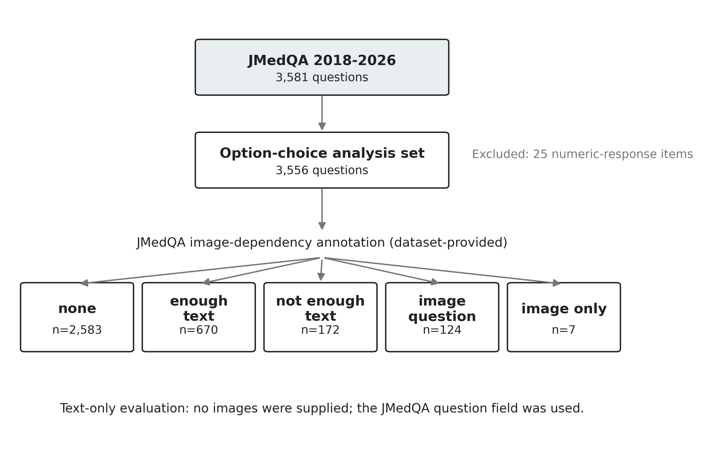
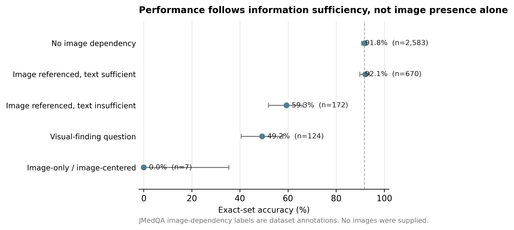
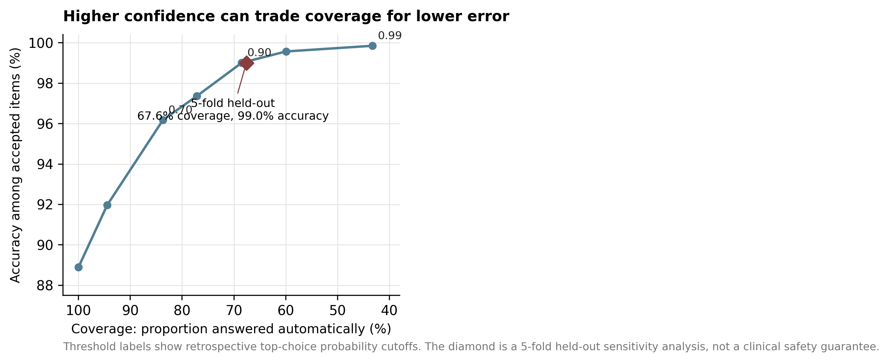
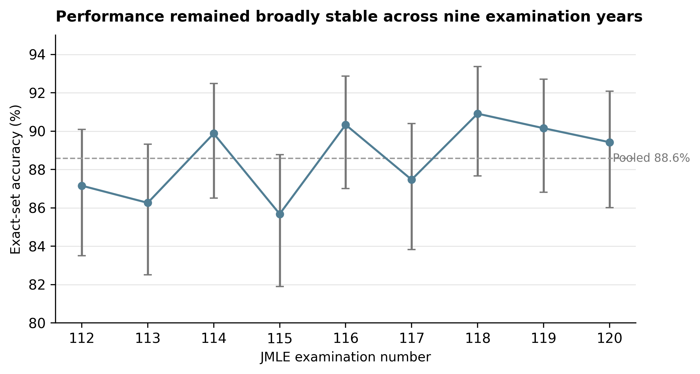

**Information Sufficiency and Selective Prediction in a Structured
Probabilistic Decision Model:  
Nine Years of the Japanese Medical Licensing Examination**

**Ren Matsushita, MD**

*Independent Researcher*

GitHub Whitepaper v1.0.0 - September 2026

# **Abstract**

**Background.** Medical licensing examinations no longer meaningfully
discriminate the strongest generative language models by accuracy alone.
More informative questions are whether a model recognizes when required
information is missing, whether its probabilities identify likely
errors, and whether confidence can support selective deferral.

**Objective.** To characterize Jev, a structured probabilistic decision
interface, on nine years of Japanese Medical Licensing Examination
(JMLE)-derived questions, with emphasis on information sufficiency,
selective prediction, accuracy, latency, and recorded API cost.

**Methods.** We evaluated typesafe/jev-1.13 through the OpenRouter
Decisions API on 3,556 option-choice JMedQA items from 2018-2026 after
excluding 25 numeric-response items. JMedQA provides dataset-level
image_dependency annotations: none, enough text, not enough text, image
question, and image only. No images were supplied; the text-only
question field was used. Probability analyses were restricted to 3,097
single-select items. Selective prediction was assessed descriptively and
with a 5-fold held-out sensitivity analysis.

**Results.** Overall exact-set accuracy was 88.58% (3,150/3,556; 95% CI,
87.50%-89.59%). Accuracy was 91.75% for items annotated as having no
image dependency and 92.09% for image-associated items annotated as
answerable from text alone, but fell to 59.30% when text was annotated
as insufficient and 49.19% for visual-finding questions. In
single-select items, top-choice probability discriminated correct from
incorrect answers (AUROC, 0.918). The 5-fold held-out sensitivity
analysis accepted 67.6% of items at 99.00% accuracy. Median API
wall-clock latency was 820.7 ms; recorded total API cost was US\$0.120
for 3,556 calls.

**Conclusions.** The most informative finding was not examination
"passing" but the alignment between performance and information
sufficiency. In this closed-ended benchmark, a low-cost structured
decision layer performed well when the text contained enough information
and its native probabilities supported deferral of uncertain cases.
These findings motivate routing architectures, not autonomous clinical
use.

Keywords: Japanese Medical Licensing Examination; JMedQA; medical
artificial intelligence; uncertainty; selective prediction; information
sufficiency; calibration

# **1. Introduction**

Medical licensing examinations have become standard benchmarks for
medical artificial intelligence. GPT-4 and later multimodal systems have
already reached passing or very high performance on the Japanese Medical
Licensing Examination (JMLE) \[1,2\]. Consequently, the question "can an
AI pass the licensing examination?" now provides limited discrimination
among capable systems.

For deployment-oriented evaluation, different properties matter: whether
a system can recognize when the input lacks information required for a
decision, whether its uncertainty is informative, and whether easy
high-confidence cases can be processed cheaply while difficult or
incomplete cases are deferred. Broader frameworks such as MedHELM and
HealthBench similarly emphasize that examination accuracy alone does not
represent the diversity of clinical work \[6,7\].

Jev differs operationally from a conventional generative assistant. Its
Choice interface receives predefined alternatives and returns a selected
option together with a probability distribution over those alternatives
\[11,12\]. We use the descriptive term structured probabilistic decision
model to refer to this interface behavior; it is not a claim about
undisclosed internal architecture.

JMedQA is especially useful for asking whether performance tracks
information sufficiency. In addition to nine years of JMLE-derived
questions, the dataset provides image_dependency annotations that
distinguish questions with no image dependence from image-associated
questions that remain answerable from text, questions for which text
alone is insufficient, and questions that explicitly require visual
interpretation \[3\]. This taxonomy makes it possible to ask a more
precise question than whether an item merely contains an image.

We therefore evaluated four linked questions: (1) overall benchmark
accuracy and operational efficiency across nine JMLE years; (2) whether
performance follows JMedQA-defined information sufficiency under
text-only evaluation; (3) whether native option probabilities identify
likely errors and support selective deferral; and (4) how stable the
results are across years and under conservative official-score
reconstruction.

# **2. Methods**

## **2.1 Study design and analysis set**

We conducted a retrospective benchmark using JMedQA, a public dataset
derived from JMLE materials released by the Ministry of Health, Labour
and Welfare. The evaluated release contained 3,581 questions from the
112th through 120th examinations (2018-2026). Twenty-five
numeric-response items were excluded because the Jev Choice interface
requires predefined alternatives, leaving 3,556 option-choice items:
3,097 single-answer and 459 multiple-answer items \[3\].

## **2.2 JMedQA image-dependency taxonomy and text-only input**

The central information-sufficiency analysis used JMedQA's
dataset-provided image_dependency annotation; we did not infer these
labels from Jev outputs. In the dataset documentation, none indicates no
image dependency; enough text indicates that an image is referenced but
the textual information is sufficient to answer; not enough text
indicates that an image is referenced and text alone is insufficient;
image question indicates that visual findings, image interpretation, or
diagnosis from an image are explicitly required; and image only denotes
questions whose text consists primarily of an image reference \[3\].

JMedQA provides both question_raw, which preserves explicit
image-reference phrases, and question, which removes those phrases for
text-only evaluation when image_dependency is not none. We used the
question field and supplied no images. Thus, the comparison among
image_dependency strata should be interpreted as a text-only benchmark
conditioned on the dataset's information-sufficiency annotation, not as
a paired causal experiment in which an image was removed from the same
item \[3\].

Figure 1. Study flow and JMedQA image-dependency strata. The labels are
supplied by JMedQA and were not generated by the evaluated model. No
images were provided during inference.

## **2.3 Model and inference**

Inference used the fixed route typesafe/jev-1.13 through the OpenRouter
Decisions API; the returned serving build was
typesafe/jev-1.13-20260917. No role prompting, chain-of-thought request,
few-shot example, retrieval, or external medical reference material was
supplied. Each response record stored the selected option, per-option
probabilities, model/build metadata, token usage, recorded cost, and
wall-clock latency.

## **2.4 Scoring and probability analyses**

Single-answer questions were scored by the highest-probability option.
For multiple-answer questions, the prespecified number k of gold answers
was selected by ranking Choice probabilities and taking the top k; exact
set equality was required. Because the Choice distribution is mutually
exclusive rather than a calibrated multilabel distribution,
probability-quality analyses were restricted to single-select items.

For single-select items, we calculated negative log loss, multiclass
Brier score, 10-bin expected calibration error (ECE), AUROC of
top-choice probability for correctness, and risk-coverage curves. To
reduce optimism from selecting a confidence threshold on the same
observations used to report performance, we performed a 5-fold
sensitivity analysis: in each fold, the lowest threshold yielding at
least 99% accepted-item accuracy was selected on the remaining four
folds and then applied to the held-out fold. This was an internal
sensitivity analysis, not external validation.

## **2.5 Statistical analysis and examination reconstruction**

Accuracy confidence intervals used the Wilson method. Differences
between nonpaired item groups used Newcombe intervals and chi-square or
Fisher exact tests as appropriate. Latency distributions were compared
with the Mann-Whitney U test. Annual trend was explored with Spearman
rank correlation across yearly aggregate accuracies. Published Ministry
of Health, Labour and Welfare score thresholds were used for
conservative exam-by-exam reconstruction. Formal pass/fail was not
asserted because contraindicated-choice identities are not public and
some numeric-response or officially adjusted items could not be
reproduced identically.

## **2.6 Ethics, transparency, and reproducibility**

The study used public examination-derived material and no patient or
research-participant data; institutional review board review was
therefore not sought. Code, derived result files, statistical scripts,
environment information, and manuscript materials are available from the
project repository. Examination question text and images are not
redistributed.

# **3. Results**

## **3.1 Overall performance and operational measurements**

Jev answered 3,150 of 3,556 option-choice items correctly (88.58%; 95%
CI, 87.50%-89.59%). Median API wall-clock latency was 820.7 ms and p95
latency was 1,061.0 ms. The run recorded 2,858,460 input tokens and a
total API cost of US\$0.120. These are gateway-level measurements and
should not be interpreted as model-only inference latency or underlying
compute cost.

**Table 1. Primary benchmark outcomes**

| **Condition**                    | **n** | **Correct** | **Accuracy (95% CI)** | **Median latency** |
|----------------------------------|-------|-------------|-----------------------|--------------------|
| All option-choice                | 3,556 | 3,150       | 88.58% (87.50-89.59)  | 820.7 ms           |
| No image reference               | 2,582 | 2,369       | 91.75% (90.63-92.75)  | 820.3 ms           |
| Image referenced; image withheld | 974   | 781         | 80.18% (77.57-82.57)  | 822.6 ms           |

The binary image-presence grouping and the annotation-based
`image_dependency` grouping are not identical. One item (2023C074) was
classified as image-referenced by the metadata-based helper because auxiliary
image metadata were present, although its JMedQA `image_dependency` label was
`none`. Therefore, the binary no-image group contained 2,582 items, whereas
the annotation-based `none` stratum contained 2,583 items. This does not alter
the overall benchmark denominator or the annotation-stratified results.

## **3.2 Performance tracked information sufficiency**

The binary image-referenced group was 11.57 percentage points lower than
the no-image-reference group (95% CI, -14.28 to -8.85; P\<.001), but
these were different questions and this contrast is descriptive rather
than causal. The JMedQA image_dependency strata provide the more
interpretable result: none and enough text had nearly identical accuracy
(91.75% vs 92.09%; difference, +0.34 percentage points; 95% CI, -2.16 to
+2.47), whereas performance dropped to 59.30% for not enough text and
49.19% for image question. The seven image only items were all
incorrect, but that stratum was too small for a stable estimate.

This pattern is important because "enough text" and "not enough text"
are not labels created after observing Jev performance. They are JMedQA
annotations describing whether the question text itself contains enough
information for a text-only model. The observed gradient is therefore
consistent with a simple interpretation: the model performed well when
the necessary evidence was present in the input and degraded when the
missing modality contained task-relevant evidence.

Figure 2. Exact-set accuracy by JMedQA image_dependency annotation.
Error bars are Wilson 95% confidence intervals. The near-overlap of none
and enough text is the key contrast; performance drops when the dataset
annotation indicates that text alone is insufficient.

**Table 2. JMedQA image-dependency taxonomy and observed performance**

| **JMedQA label** | **Dataset definition**                              | **n** | **Accuracy** |
|------------------|-----------------------------------------------------|-------|--------------|
| none             | No image dependency                                 | 2,583 | 91.75%       |
| enough text      | Image referenced; text is sufficient                | 670   | 92.09%       |
| not enough text  | Image referenced; text alone is insufficient        | 172   | 59.30%       |
| image question   | Visual finding / interpretation explicitly required | 124   | 49.19%       |
| image only       | Question is primarily an image reference            | 7     | 0.00%        |

## **3.3 Native probabilities supported selective deferral**

Among 3,097 single-select items, accuracy was 88.89%. Top-choice
probability discriminated correct from incorrect answers with AUROC
0.918; 10-bin ECE was 0.014, negative log loss 0.366, and multiclass
Brier score 0.157. We do not interpret ECE alone as proof of
calibration.

Retrospectively, a top-choice probability threshold of 0.90 accepted
68.5% of single-select items with 99.01% accuracy. In the 5-fold
held-out sensitivity analysis, thresholds of 0.90 or 0.92 selected on
calibration folds accepted 2,093 of 3,097 held-out items in aggregate
(67.6% coverage), of which 2,072 were correct (99.00%). This reduces,
but does not eliminate, optimism from post hoc threshold selection and
does not establish a clinical safety guarantee.

Figure 3. Risk-coverage trade-off for single-select questions. Raising
the confidence threshold decreases the proportion of items answered
automatically while increasing accuracy among accepted items. The
diamond summarizes the 5-fold held-out sensitivity analysis.

## **3.4 Performance was broadly stable across examination years**

Annual exact-set accuracy ranged from 85.68% on the 115th examination to
90.91% on the 118th examination. A monotonic trend across the nine
annual aggregates was not statistically demonstrated (Spearman
rho=0.533; P=.139). Because Jev is a closed model and historical JMLE
items are public, this absence of a trend does not rule out
training-data contamination.

Figure 4. Year-by-year exact-set accuracy with Wilson 95% confidence
intervals. The dashed line is the pooled nine-year accuracy.

## **3.5 Conservative official-score reconstruction**

For each 112th-120th examination, the conservative lower bound of the
reconstructed required-section and general/clinical scores exceeded that
year's published score threshold. This supports the narrow statement
that published score cutoffs were exceeded under the reconstruction. It
does not support the statement that Jev formally passed the JMLE,
because contraindicated-choice identities are undisclosed and non-option
or officially adjusted items cannot be reproduced identically.

# **4. Discussion**

## **4.1 The central result is information sufficiency, not examination passing**

The clearest finding is that benchmark performance followed whether the
input contained the information needed for the task. Image association
by itself did not reduce performance: questions annotated by JMedQA as
image-associated but answerable from text were solved at essentially the
same rate as questions with no image dependency. In contrast,
performance fell sharply when JMedQA annotated the text as insufficient
or the task as requiring visual interpretation. This makes the result
more informative than a simple "image versus no image" comparison.

This interpretation is deliberately narrower than a claim about model
reasoning. Because the image-dependency labels were created by the
dataset authors and the item groups were not paired counterfactual
versions of the same question, the study cannot estimate the causal
effect of removing an image. It can show, however, that performance
stratified in the expected direction across an independently supplied
taxonomy of text sufficiency. That pattern supports information
availability as a practical boundary condition for this model interface.

## **4.2 Native probabilities are most useful as a routing signal**

The second important finding is not that Jev knows when it is correct
with certainty, but that its native Choice probabilities contain useful
error-ranking information. Correct and incorrect single-select answers
were strongly separable by top-choice probability, and confidence gating
produced a favorable risk-coverage trade-off. The held-out sensitivity
analysis suggests that this signal is not solely an artifact of choosing
one threshold on the full dataset, although prospective validation
remains necessary.

These properties suggest a possible role for structured decision models
as a first-stage router in systems where the task already has a
constrained option set: high-confidence, information-complete cases
could be handled cheaply, while low-confidence or information-incomplete
cases are escalated to a larger generative model, a multimodal model, or
a human. The present study does not test such an end-to-end
architecture, so this should be understood as a design hypothesis
generated by the benchmark rather than a deployment recommendation.

## **4.3 Relation to prior medical-exam studies**

Prior work has already shown passing or high JMLE performance for GPT-4
and GPT-4o \[1,2\]. The present study should not be interpreted as a
rank-order comparison with those systems because the evaluated years,
prompts, modalities, and model classes differ. Its contribution is
instead the joint characterization of nine-year performance,
dataset-defined information sufficiency, native option probabilities,
selective prediction, and API-level latency and cost.

## **4.4 Why these results do not establish clinical competence**

A licensing examination is a static, closed-ended task. Clinical work
requires active information gathering, generation and revision of
differential diagnoses, treatment planning, communication,
documentation, and adaptation to evolving patient states \[6,7\]. An
88.6% examination accuracy therefore cannot be translated into an 88.6%
rate of correct clinical decisions. The selective-prediction result
likewise does not establish a safe clinical threshold.

## **4.5 Adversarial interpretation and strongest threats to validity**

**Training-data contamination.** JMLE questions are public and Jev is
closed; memorization cannot be excluded. The absence of a recent-year
performance decline is not evidence that contamination is absent.

**Multiple-answer semantics.** Top-k ranking of a mutually exclusive
Choice distribution is a heuristic for multilabel questions. Calibration
claims were therefore restricted to single-select items, and an
independent per-option binary sensitivity analysis remains desirable.

**No matched generative baseline.** The study measures absolute latency,
cost, and accuracy, but cannot establish comparative superiority over
GPT-4o, GPT-5, Claude, or another model without identical-condition
evaluation.

**Single serving build and limited repeatability.** A closed API may
change over time. Repeated runs are needed to quantify answer stability
and probability variance.

**Internal validation of deferral.** The 5-fold analysis is stronger
than a single in-sample threshold but remains internal. A prospective,
prespecified threshold on unseen or embargoed items is required before
operational claims.

## **4.6 Next decisive experiment**

The most informative next study is not another larger retrospective JMLE
run. It is a prospective routing experiment on newly authored or
embargoed items: predefine a calibration set and confidence threshold,
route low-confidence or modality-incomplete cases to a larger multimodal
model or clinician, and compare end-to-end accuracy, residual error,
latency, and cost against an "always use the large model" strategy. Such
an experiment would directly test the practical hypothesis generated
here.

# **5. Limitations**

This study evaluated one closed model build at one time point; training
data are unknown; contamination by public examination material cannot be
excluded; image-dependency groups were not paired; no images were
supplied; JMedQA annotations and extraction may contain residual errors;
multi-answer top-k scoring has a semantic limitation; no
identical-condition generative baseline was included; repeated inference
was limited; selective prediction was internally rather than
prospectively validated; and formal pass/fail could not be determined
because contraindicated-choice identities are not public.

# **6. Conclusions**

Across nine years of JMLE-derived option-choice questions, Jev achieved
high benchmark accuracy with subsecond median API wall-clock latency and
very low recorded API cost. The more informative result was the boundary
condition: performance was preserved when text contained sufficient
information, even for image-associated questions, and deteriorated when
task-relevant visual information was absent. Native option probabilities
also supported selective deferral of uncertain single-select items.
Together, these findings motivate further study of low-cost structured
decision layers as routers within larger decision systems, not as
autonomous clinical agents.

# **Declarations**

Funding: This research received no external funding.

Competing interests: The author declares no competing interests with
TypeSafe, OpenRouter, JMedQA developers, or other relevant entities.

Data and code availability: Code, derived result files, statistical
scripts, environment information, and manuscript materials are available
at https://github.com/kokuren333/jev-jmle-benchmark. Examination
question text and images are not redistributed; users should obtain
JMedQA from its original source and follow the applicable terms of use.

Generative AI disclosure: Generative AI tools were used to assist code
development, statistical workflow design, literature discovery, language
editing, figure redesign, and manuscript drafting. The author reviewed
the analyses, numerical results, references, interpretations, and final
manuscript and assumes full responsibility for the work.

Author contributions: Ren Matsushita: Conceptualization, Methodology,
Software, Formal Analysis, Investigation, Visualization, Writing -
Original Draft, Writing - Review & Editing.

# **References**

1\. Tanaka Y, Nakata T, Aiga K, et al. Performance of Generative
Pretrained Transformer on the National Medical Licensing Examination in
Japan. PLOS Digital Health. 2024;3(1):e0000433.
doi:10.1371/journal.pdig.0000433.

2\. Miyazaki Y, Hata M, Omori H, et al. Performance of ChatGPT-4o on the
Japanese Medical Licensing Examination: Evaluation of Accuracy in
Text-Only and Image-Based Questions. JMIR Medical Education.
2024;10:e63129. doi:10.2196/63129.

3\. Yamagishi Y, Kobayashi K, Shibaki R, Aizawa A, Kurohashi S. JMedQA:
Benchmarking Large Language Models and Vision-Language Models on the
Japanese Medical Licensing Examination. Hugging Face dataset. 2026.
https://huggingface.co/datasets/SIP-med-LLM/JMedQA. Accessed June 25,
2026.

4\. Singhal K, Azizi S, Tu T, et al. Large language models encode
clinical knowledge. Nature. 2023;620:172-180.
doi:10.1038/s41586-023-06291-2.

5\. Bentegeac R, Le Guellec B, Kuchcinski G, Amouyel P, Hamroun A. Token
Probabilities to Mitigate Large Language Models Overconfidence in
Answering Medical Questions: Quantitative Study. J Med Internet Res.
2025;27:e64348. doi:10.2196/64348.

6\. Bedi S, Cui H, Fuentes M, et al. Holistic evaluation of large
language models for medical tasks with MedHELM. Nature Medicine.
2026;32:943-951. doi:10.1038/s41591-025-04151-2.

7\. OpenAI. HealthBench: An evaluation for AI systems and human health.
2025.

8\. McCoy LG, Swamy R, Sagar N, et al. Do Language Models Think Like
Doctors? medRxiv. 2025. doi:10.1101/2025.02.11.25321822.

9\. Large language model uncertainty proxies: discrimination and
calibration for medical diagnosis and treatment. 2024. PMCID:
PMC11648734.

10\. Ministry of Health, Labour and Welfare, Japan. Official passing
criteria and answer keys for the 112th-120th Japanese Medical Licensing
Examinations, 2018-2026.

11\. TypeSafe / Jev API documentation. Jev Choice API. Accessed
September 2026.

12\. OpenRouter. TypeSafe: Jev 1.13 model page. Accessed September 2026.
